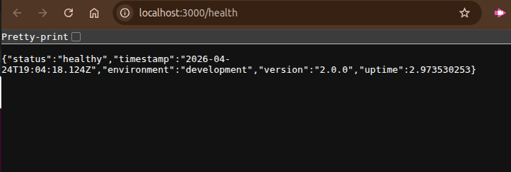
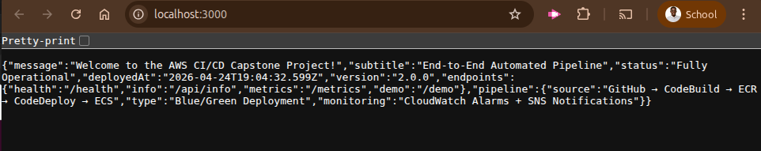

# AWS CI/CD Capstone Project: End-to-End Production Pipeline

[](https://aws.amazon.com)
[](https://aws.amazon.com/codepipeline/)
[](https://www.docker.com)
[](https://aws.amazon.com/ecs/)

---

## Project Overview

This is a **production-grade, fully automated CI/CD pipeline** on AWS that demonstrates modern DevOps practices. The pipeline automatically takes code from GitHub, builds and tests it, packages it into a Docker container, and deploys it to Amazon ECS Fargate behind an Application Load Balancer with Blue/Green deployment strategy.

### Key Features

- **Complete CI/CD Pipeline**: GitHub → CodeBuild → ECR → CodeDeploy → ECS
- **Containerization**: Dockerized Node.js application
- **Zero-Downtime Deployments**: Blue/Green deployment strategy
- **Comprehensive Monitoring**: CloudWatch alarms with SNS notifications
- **Manual Approval Gate**: Production deployment control
- **Production-Ready**: Security headers, rate limiting, health checks
- **Auto-scaling Ready**: ECS service with scaling policies
- **Secure by Design**: IAM least privilege, non-root containers

##  Table of Contents

- [Project Overview](#project-overview)
- [Architecture](#architecture)
- [Repository Structure](#repository-structure)
- [Prerequisites](#prerequisites)
- [Step-by-Step Setup Guide](#step-by-step-setup-guide)
  - [Step 1: Application & GitHub](#step-1-application--github)
  - [Step 2: Set Up ECR](#step-2-set-up-ecr)
  - [Step 3: ECS Cluster & Service](#step-3-ecs-cluster--service)
  - [Step 4: Configure CodeBuild](#step-4-configure-codebuild)
  - [Step 5: Configure CodeDeploy](#step-5-configure-codedeploy)
  - [Step 6: Create CodePipeline](#step-6-create-codepipeline)
  - [Step 7: Monitoring & Alerts](#step-7-monitoring--alerts)
- [File Reference](#file-reference)
- [Testing Locally](#testing-locally)
- [Troubleshooting](#troubleshooting)

---


## Architecture

```
GitHub (push) 
    │
    ▼
AWS CodePipeline
    │
    ├── Stage 1: SOURCE ──────── GitHub repository
    │
    ├── Stage 2: BUILD ───────── CodeBuild
    │                               ├── Install dependencies
    │                               ├── Run unit tests (Jest)
    │                               ├── Build Docker image
    │                               └── Push image → Amazon ECR
    │
    ├── Stage 3: APPROVAL ─────── Manual approval gate (SNS email)
    │
    ├── Stage 4: DEPLOY ──────── CodeDeploy (Blue/Green)
    │                               └── Update ECS Task Definition
    │                                   └── ECS Fargate Service
    │                                          └── App Load Balancer
    │
    └── Monitoring: CloudWatch Alarms + SNS Notifications
```

See `pipeline-diagram.png` for the visual architecture diagram.

---

## Repository Structure

```
myapp/
├── src/
│   ├── app.js              # Express.js application
│   ├── package.json        # Node.js dependencies
│   └── package-lock.json   # Locked dependency
├── tests/
│   └── app.test.js         # Jest unit tests
    └── health.test.js      # health unit tests
├── Dockerfile              # Multi-stage Docker build
├── buildspec.yml           # CodeBuild instructions
├── appspec.yml             # CodeDeploy ECS deployment spec
├── taskdef.json            # ECS Task Definition template
├── pipeline-diagram.png    # Architecture diagram
└── README.md               # This file
```

---

## Prerequisites

| Requirement | Details |
|---|---|
| AWS Account | With permissions for CodePipeline, CodeBuild, CodeDeploy, ECS, ECR, IAM, CloudWatch |
| GitHub Account | Repository with your code |
| AWS CLI | Installed and configured (`aws configure`) |
| Docker | Installed locally for testing |
| Node.js 18+ | For local development |

---

## Step-by-Step Setup Guide

### Step 1: Application & GitHub

1. Fork or clone this repository to your GitHub account.
2. Ensure your repo is **public** or that you have set up a GitHub connection in AWS.
3. Verify the app runs locally:

```bash
cd src
npm install
npm test        
npm start       
```

---

### Step 2: Set Up ECR

Create the ECR repository where Docker images will be stored:

```bash
aws ecr create-repository \
  --repository-name myapp-repo \
  --region us-east-1
```

Note the **repository URI** returned — you'll need it in later steps.  
Format: `<ACCOUNT_ID>.dkr.ecr.<REGION>.amazonaws.com/myapp-repo`

---

### Step 3: ECS Cluster & Service

#### 3a. Create ECS Cluster

```
AWS Console → ECS → Clusters → Create Cluster
  Name:              myapp-cluster
  Infrastructure:    AWS Fargate (serverless)
```

#### 3b. Create Application Load Balancer

```
EC2 Console → Load Balancers → Create → Application Load Balancer
  Name:          myapp-alb
  Scheme:        Internet-facing
  Listeners:     HTTP port 80
  Target Group:  myapp-tg-blue  (port 3000, HTTP, /health)
```

Also create a second target group `myapp-tg-green` for Blue/Green.

#### 3c. Register the Task Definition

Update `taskdef.json` with your `<ACCOUNT_ID>`, then register:

```bash
aws ecs register-task-definition \
  --cli-input-json file://taskdef.json \
  --region us-east-1
```

#### 3d. Create ECS Service

```
ECS Console → myapp-cluster → Create Service
  Launch type:       Fargate
  Task definition:   myapp-task
  Service name:      myapp-service
  Desired count:     1
  Load balancer:     myapp-alb
  Deployment type:   Blue/Green (CodeDeploy)
```

---

### Step 4: Configure CodeBuild

#### 4a. Store account ID in Parameter Store

```bash
aws ssm put-parameter \
  --name "/myapp/account_id" \
  --value "<YOUR_ACCOUNT_ID>" \
  --type "String"
```

#### 4b. Create CodeBuild Project

```
CodeBuild Console → Create build project
  Project name:       myapp-build
  Source:             GitHub → your repository
  Environment:        Managed image → Ubuntu → Standard → aws/codebuild/standard:7.0
  Privileged:         YES (required for Docker builds)
  Service role:       Create new or use existing
  Buildspec:          Use buildspec.yml in repo
```

#### 4c. IAM Permissions for CodeBuild Role

Attach these policies to the CodeBuild service role:
- `AmazonECR_FullAccess`
- `AmazonSSMReadOnlyAccess`
- `CloudWatchLogsFullAccess`

---

### Step 5: Configure CodeDeploy

#### 5a. Create CodeDeploy Application

```
CodeDeploy Console → Applications → Create
  Application name:    myapp-deploy
  Compute platform:    Amazon ECS
```

#### 5b. Create Deployment Group

```
  Deployment group name:   myapp-dg
  Service role:            AWSCodeDeployRoleForECS
  ECS cluster:             myapp-cluster
  ECS service:             myapp-service
  Load balancer:           myapp-alb
  Target groups:           myapp-tg-blue / myapp-tg-green
  Deployment config:       CodeDeployDefault.ECSAllAtOnce
  Deployment type:         Blue/Green
```

---

### Step 6: Create CodePipeline

```
CodePipeline Console → Create Pipeline
  Pipeline name:    myapp-pipeline
  Role:             Create new service role
```

**Add stages:**

| Stage | Provider | Config |
|---|---|---|
| Source | GitHub (v2) | Repo: `myapp`, Branch: `main` |
| Build | CodeBuild | Project: `myapp-build` |
| Approval | Manual Approval | SNS topic: `myapp-approvals` (email) |
| Deploy | CodeDeploy | App: `myapp-deploy`, Group: `myapp-dg` |

---

### Step 7: Monitoring & Alerts

#### 7a. Create SNS Topic

```bash
aws sns create-topic --name myapp-alerts
aws sns subscribe \
  --topic-arn arn:aws:sns:us-east-1:<ACCOUNT_ID>:myapp-alerts \
  --protocol email \
  --notification-endpoint your@email.com
```

Confirm the subscription from your email inbox.

#### 7b. Create CloudWatch Alarm — ECS CPU

```
CloudWatch Console → Alarms → Create Alarm
  Metric:        ECS → ClusterName/ServiceName → CPUUtilization
  Threshold:     > 80% for 2 consecutive periods
  Period:        5 minutes
  Action:        Send notification to myapp-alerts (SNS)
```

#### 7c. Create CloudWatch Alarm — Pipeline Failures

```
  Metric:        CodePipeline → ExecutionsFailed
  Threshold:     >= 1
  Period:        5 minutes
  Action:        Send notification to myapp-alerts (SNS)
```

---

## File Reference

| File | Purpose |
|---|---|
| `src/app.js` | Express.js web application with `/` and `/health` routes |
| `src/package.json` | Node.js dependencies (Express, Jest, Supertest) |
| `tests/app.test.js` | Unit tests using Jest + Supertest |
| `Dockerfile` | Multi-stage Docker build (test → production) |
| `buildspec.yml` | CodeBuild: login to ECR, run tests, build & push image |
| `appspec.yml` | CodeDeploy: Blue/Green ECS deployment specification |
| `taskdef.json` | ECS Task Definition template (Fargate, port 3000) |

---

## Testing Locally

```bash
# Install dependencies
cd src && npm install

# Run tests
npm test

# Build Docker image locally
cd ..
docker build -t myapp:local .

# Run container locally
docker run -p 3000:3000 myapp:local

# Test endpoints
curl http://localhost:3000/          # Main page
curl http://localhost:3000/health    # Health check → {"status":"healthy"}
```

---

## Troubleshooting

| Issue | Solution |
|---|---|
| CodeBuild: `docker: Cannot connect to Docker daemon` | Enable **Privileged mode** in CodeBuild environment settings |
| ECR push fails | Ensure CodeBuild IAM role has `ecr:GetAuthorizationToken` and `ecr:InitiateLayerUpload` |
| ECS tasks not starting | Check CloudWatch Logs under `/ecs/myapp-task` for container errors |
| ALB health checks failing | Ensure security group allows port 3000 inbound from ALB |
| CodeDeploy stuck | Verify `appspec.yml` container name matches `taskdef.json` exactly |
| Pipeline not triggering | Check GitHub connection is authorized in AWS Developer Tools |

---
Deployed on Amazon ECS Fargate with full Blue/Green CI/CD automation.

### Images


*Figure 1: Project Structure locally*



*Figure 2: Pipeline diagram with clear picture of how the architecture looks like for the project*



*Figure 3: Confirming after testing the application the helath endpoint is working*



*Figure 4: Confirming after testing the application the root endpoint is working*
